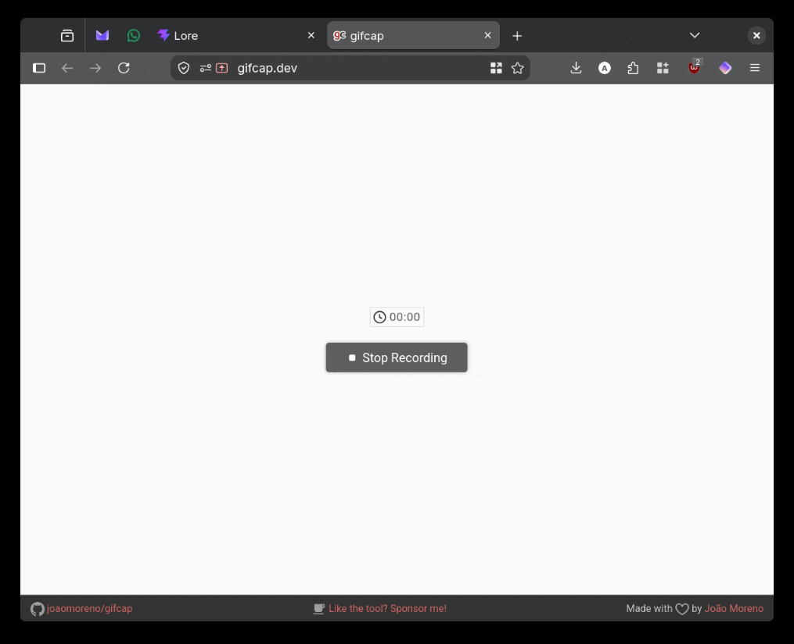

# lore
local object retrieval engine



> [!IMPORTANT]
> This is a highly experimental project. I used some 3rd-party packages that don't have stable versions yet.

- [What Is Lore?](#what-is-lore)
- [But Why?](#but-why)
- [How Does It Work?](#how-does-it-work)
  - [Ingestion](#ingestion)
    - [Supported Documents](#supported-documents)
  - [Searching](#searching)
  - [RAG](#rag)
- [Getting Started](#getting-started)
  - [Persist Application Data](#persist-application-data)
  - [Documents to Index](#documents-to-index)
  - [Running with Local Models](#running-with-local-models)
  - [Running from Source](#running-from-source)
- [Features](#features)
  - [Agentic / Traditional RAG Service](#agentic--traditional-rag-service)
  - [MCP](#mcp)
  - [Settings](#settings)
- [Tools](#tools)
- [Telemetry](#telemetry)
- [Development Checks](#development-checks)
- [Project Status](#project-status)
- [License](#license)


## What Is Lore?

Lore is a local-first, highly customizable RAG application that lets you chat
with an LLM about your local documents. Lore watches folders on your machine,
extracts and indexes their contents, and retrieves relevant pieces when you ask
a question.

Lore is designed with local-first in mind, but you can still use it with any
OpenAI-compatible API.

## But Why?

I wanted to experiment with a couple of technologies like [Semantic
Kernel](https://learn.microsoft.com/en-us/semantic-kernel/overview/), MCP
servers, vector search, you know, all the AI hype stuff.

## How Does It Work?

### Ingestion

```text
file arrival
    -> text extraction and OCR
    -> semantic classification
    -> text chunking
    -> embedding and vector storage
    -> searchable document
```

The pipeline uses channels and background services so file ingestion does not
block the web application. Files are hashed, tracked, and reprocessed when
their contents change.

#### Supported Documents

- Plain text: `.txt`, `.log`, `.csv`, `.md`, `.markdown`, `.sql`, `.css`
- Web and structured text: `.html`, `.htm`, `.xml`, `.json`, `.jsonl`, `.ndjson`
- PDF: `.pdf`
- Word documents: `.doc`, `.docx`, `.docm`, `.dotx`, `.dotm`, `.odt`, `.rtf`
- Presentations: `.ppt`, `.pptx`
- Spreadsheets: `.xls`, `.xlsx`, `.ods`
- Images with OCR: `.png`, `.jpg`, `.jpeg`, `.bmp`, `.gif`

Text extraction libraries: PdfPig, DocumentFormat.OpenXml, NPOI.HWPF,
ExcelDataReader, HtmlAgilityPack, RapidOcrNet

### Searching

Lore combines two types of search:

- **Full-text search:** Finds exact words and phrases using SQLite FTS5.
- **Vector search:** Finds semantically similar text using sqlite-vec.

The results are combined so Lore can find something whether you remember the
exact words or only the general idea.

### RAG

Lore offers two types of RAG experience:

- **Agentic:** Does not provide any document to the LLM, but lets the LLM find
  the files through provided [tools](#tools). The model you pick must support
  tool calling.
- **Traditional:** Finds the documents first and passes them to the model with
  the user prompt.

## Getting Started

The easiest way to run Lore locally is by using the Docker image provided in
this repository. Run the code below and go to `http://localhost:8080`.

```bash
docker run -d --name lore \
  -p 8080:8080 \
  --add-host=host.docker.internal:host-gateway \
  -v "$(pwd):/app/lore" \
  -v /home/user_name/documents/:/app/lore/data/documents \
  ghcr.io/arunes/lore:latest
```

### Persist Application Data

Map any folder on your computer to `/app/lore` to persist data between
restarts. The database, embedding model, OCR models, and other application data
are stored there.

### Documents to Index

You can map as many directories as you want to the `/app/lore/data` folder. All
directories mapped there are automatically indexed when the Docker container
starts.

### Running with Local Models

To use Lore with a local model running in Ollama or LM Studio, use the
`--add-host=host.docker.internal:host-gateway` argument when running the
container. This makes sure that Lore inside the Docker container can reach your
local host.

### Running from Source

You need the .NET 10 SDK, Node.js, and pnpm.

```bash
dotnet restore Lore.App/Lore.App.csproj
dotnet build Lore.App/Lore.App.csproj --no-restore

cd Lore.UI
pnpm install --frozen-lockfile
pnpm build
```

Run the application from the repository root:

```bash
dotnet run --project Lore.App/Lore.App.csproj
```

The development application uses port `8081`. You can change the data location
with `LORE_DATA_ROOT`:

```bash
LORE_DATA_ROOT=/tmp/lore-data dotnet run --project Lore.App/Lore.App.csproj
```

After starting Lore, configure the LLM endpoint, model, API key, RAG backend,
and file sources through the Settings page.

## Features

### Agentic / Traditional RAG Service

- Agentic RAG does not provide any document to the LLM, but lets the LLM find
  the files through provided [tools](#tools). The model you pick must support
  tool calling.
- Traditional RAG finds the documents first and passes them inside the prompt.
- Both modes stream the answer from the configured LLM.

### MCP

Lore comes with a built-in MCP server that can be accessed from the `/mcp` path.
It provides the tools that Agentic RAG uses.

### Settings

The Settings page lets you configure the OpenAI-compatible API URL, API key,
chat model, RAG backend, system prompts, retrieval limits, search weights,
temperatures, OCR models, agentic tools, and file sources.

## Tools

All the tools below are available by default to Agentic RAG and the built-in MCP
server. You can disable certain tools on the Settings page.

- **Search File Contents:** Searches the contents of indexed files by topic,
  keywords, or natural language query.
- **Search Files by Name:** Finds file paths by matching text in the file name
  or folder path.
- **Get Full File Content:** Retrieves the full text content of an indexed file.
- **Get Directory Content:** Lists files and subdirectories within a folder.
- **Search Directories by Name:** Finds directory paths matching a folder name or
  keyword.
- **Get Files by Metadata:** Filters files by category, document type, file
  extension, or date range.
- **List Available Categories and Types:** Retrieves all valid categories and
  document types available in the system.

The tools are limited to indexed data and configured file sources. They do not
provide unrestricted filesystem access.

## Telemetry

If you are interested in seeing what Lore does while processing files, you can
run a local Aspire Dashboard and add this setting to `appsettings.json`:

```json
{
  "Telemetry:Otlp:Endpoint": "http://localhost:4317"
}
```

Lore sends OpenTelemetry traces, metrics, and logs to the configured OTLP
endpoint.

## Development Checks

The repository currently does not have automated tests (yet). 
The backend and frontend checks used by the build workflow are:

```bash
dotnet restore Lore.App/Lore.App.csproj
dotnet build Lore.App/Lore.App.csproj --no-restore
dotnet format style Lore.App/Lore.App.csproj --verify-no-changes --no-restore
dotnet format analyzers Lore.App/Lore.App.csproj --verify-no-changes --no-restore
```

```bash
cd Lore.UI
pnpm install --frozen-lockfile
pnpm build
pnpm lint
```

## Project Status

Lore is experimental software. Expect incomplete features, changing behavior,
model-specific quirks, and the occasional document that refuses to become
text.

## License

Lore is licensed under the [Apache License 2.0](LICENSE).
